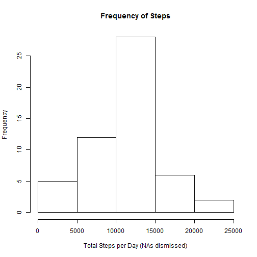
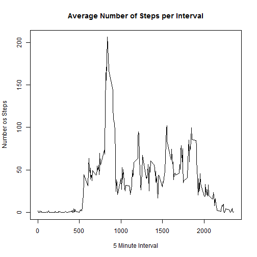
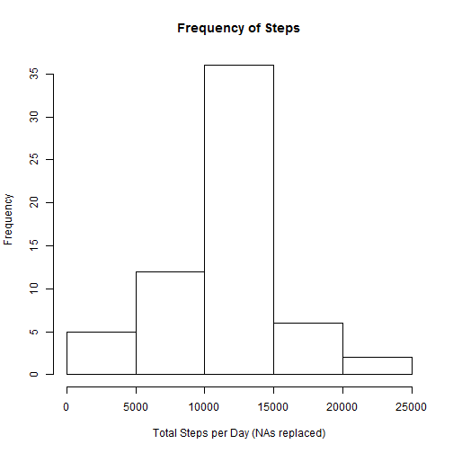
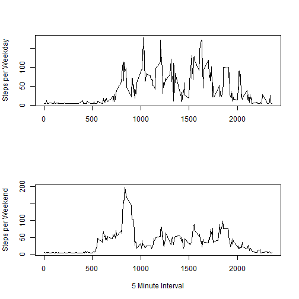

First we need to load the data

```r
dt = read.csv("activity.csv")
```

Now we will get some information wihtout minding the missing values (NAs)
Let's use 'aggregate' to sum the total steps per day

```r
dt_perday = aggregate(dt["steps"], dt["date"], sum)
```

A histogram will help to visualize the frequency of total steps taken per day

```r
hist(dt_perday$steps, main = "Frequency of Steps", xlab = "Total Steps per Day (NAs dismissed)" )
```

 

Then let us calculate the Mean and Median of the total steps taken per day. We will need to remove the NAs to do it.

```r
mean(dt_perday$steps, na.rm = T)
```

```
## [1] 10766.19
```

```r
median(dt_perday$steps, na.rm = T)
```

```
## [1] 10765
```

From now on we will focus on the five minute interval of each day. Let us get the average of steps for each interval.

```r
dt_per5 = aggregate(dt["steps"], dt["interval"], mean, na.rm = T)
```

There are 288 intervals per day, so it is better to visualize it in a graphic.

```r
plot(x = dt_per5$interval, y = dt_per5$steps, type = "l", main = "Average Number of Steps per Interval", xlab = "5 Minute Interval" , ylab = "Number os Steps")
```

 

We can also find which interval on average has the maximun number of steps

```r
mx = which.max(dt_per5$steps)
dt_per5[mx,]
```

```
##     interval    steps
## 104      835 206.1698
```

Now, ler us try to replace the NAs and see what happens
First of all, the Number of NAs

```r
sum(is.na(dt))
```

```
## [1] 2304
```

I will use a very simple strategy to replace every NA with the total average of steps in a new dataset.

```r
dt1 = dt
dt1$steps[which(is.na(dt1$steps))] = mean(dt1$steps, na.rm = T)
```


I have made the following code to try a more sophisticated replacement. In this case we replace each NA by the average of its corresponding five minute interval. But, as the results weren't 'that' different I will keep with the simpler one.


```r
library(plyr)
dt3 = dt 
impute = function(x) replace(x, is.na(x), mean(x, na.rm=T))
dt4 = ddply(dt3, ~ interval, transform, steps=impute(steps))
dt4_perday = aggregate(dt4["steps"], dt4["date"], sum)
dt5 = arrange(dt4, date)
```

Now that we have replaced the NAs let us make another histogram to look for the sum of steps taken per day

```r
dt1_perday = aggregate(dt1["steps"], dt1["date"], sum)
hist(dt1_perday$steps,main = "Frequency of Steps", xlab = "Total Steps per Day (NAs replaced)" )
```

 

Now let us calculate the mean and median of the dataset with NAs replaced

```r
mean(dt1_perday$steps)
```

```
## [1] 10766.19
```

```r
median(dt1_perday$steps)
```

```
## [1] 10766.19
```

There was no difference in the mean and a very small in the median. I guess it makes sense, since I replaced the missing values by the general mean, therefore the sum of added numbers would be divided by their quantity making no difference in the general mean. 

Now let us see if there are different patterns in weekdays and weekend. To do so we will need to convert the column 'date' to the format 'date', and check it

```r
dt1$date = strptime(x = as.character(dt$date), format = "%Y-%m-%d")
class(dt1$date)
```

```
## [1] "POSIXlt" "POSIXt"
```

Then we need to add a new column with weekdays values. As the conversion distinguishes each day of the week, we need to convert them to either weekend or weekday. I'll output the 'head' of two steps to make it clear.

```r
dt1$week = weekdays(dt1$date)
head(dt1)
```

```
##     steps       date interval          week
## 1 37.3826 2012-10-01        0 segunda-feira
## 2 37.3826 2012-10-01        5 segunda-feira
## 3 37.3826 2012-10-01       10 segunda-feira
## 4 37.3826 2012-10-01       15 segunda-feira
## 5 37.3826 2012-10-01       20 segunda-feira
## 6 37.3826 2012-10-01       25 segunda-feira
```

```r
wk1 = c("sabado", "domingo")
dt1$week = c("weekday", "weekend")[(weekdays(dt1$date)%in%wk1)+1L]
head(dt1)
```

```
##     steps       date interval    week
## 1 37.3826 2012-10-01        0 weekday
## 2 37.3826 2012-10-01        5 weekday
## 3 37.3826 2012-10-01       10 weekday
## 4 37.3826 2012-10-01       15 weekday
## 5 37.3826 2012-10-01       20 weekday
## 6 37.3826 2012-10-01       25 weekday
```

Now let us subset dataset by weekend and weekday and calculate the mean of each one. To visualize the difference we will make a double plot.

```r
dt1_perWK = subset(dt1, dt1$week == 'weekend')
dt1_perWK1 = aggregate(dt1_perWK["steps"], dt1_perWK["interval"], mean)

dt1_perWKd = subset(dt1, dt1$week == 'weekday')
dt1_perWKd1 = aggregate(dt1_perWKd["steps"], dt1_perWKd["interval"], mean)

par(mfrow = c(2,1))
plot(x = dt1_perWK1$interval, y = dt1_perWK1$steps, type = "l", xlab = "", ylab = "Steps per Weekday")
plot(x = dt1_perWKd1$interval, y = dt1_perWKd1$steps, type = "l", xlab = "5 Minute Interval", ylab = "Steps per Weekend")
```

 
